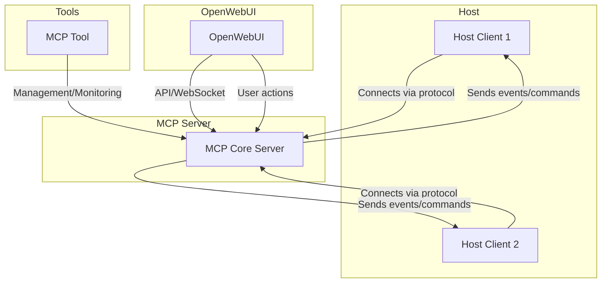

# MCP Servers

## Overview

**MCP** (Modular Communication Platform) is a highly customizable platform designed for efficient and secure communication between distributed servers, clients, and tools. It offers modular integration, extensibility, and seamless management of communications and workflows.

---

## Table of Contents

- [MCP Servers](#mcp-servers)
- [MCP Clients](#mcp-clients)
- [MCP Tools](#mcp-tools)
- [Connecting MCP with OpenWebUI](#connecting-mcp-with-openwebui)
- [Architecture Diagram](#architecture-diagram)

---

## MCP Servers

The MCP server is the central orchestrator in the MCP infrastructure. Its primary responsibilities include:

- Authenticating clients and tools
- Routing messages and commands
- Managing workflows and plugins
- Maintaining communication security and reliability

The server can be scaled horizontally and configured for high availability.

---

## MCP Clients

MCP clients are endpoints (such as applications, devices, or agents) that interact with the MCP server to send and receive commands, data, or events. Clients are lightweight and can be implemented in any language that supports the MCP protocol (usually via REST, WebSocket, or gRPC).

Typical client responsibilities:

- Sending and receiving messages
- Executing tasks triggered by the server
- Monitoring and reporting status

---

## MCP Tools

MCP tools provide auxiliary functionality for deployment, management, monitoring, and development. Examples of MCP tools include:

- Command-line utilities for deployment/configuration
- Monitoring dashboards
- Testing utilities
- Plugin managers

---

## Connecting MCP with OpenWebUI

**OpenWebUI** is a user-friendly graphical interface that can be used to control, monitor, and configure your MCP ecosystem.

### Steps to connect MCP with OpenWebUI:

1. **Install OpenWebUI** following the official guide.
2. Ensure both MCP server and OpenWebUI are accessible on your network.
3. In OpenWebUI, go to `Settings` → `Integrations` → `Add MCP Server`.
4. Enter the MCP server's URL and authentication token or credentials.
5. Save and test the connection.
6. Upon success, you can:
   - View connected MCP clients and their status
   - Send commands to clients
   - Monitor logs and events
   - Manage plugins and tools

---

## Architecture Diagram

This diagram illustrates:

- **Host clients** connect to the **MCP Server** for two-way communication.
- **MCP Tools** connect for management and monitoring purposes.
- **OpenWebUI** provides a graphical interface for users to interact with the MCP Server, send commands, and monitor the system.

---

## License

[MIT](LICENSE)
